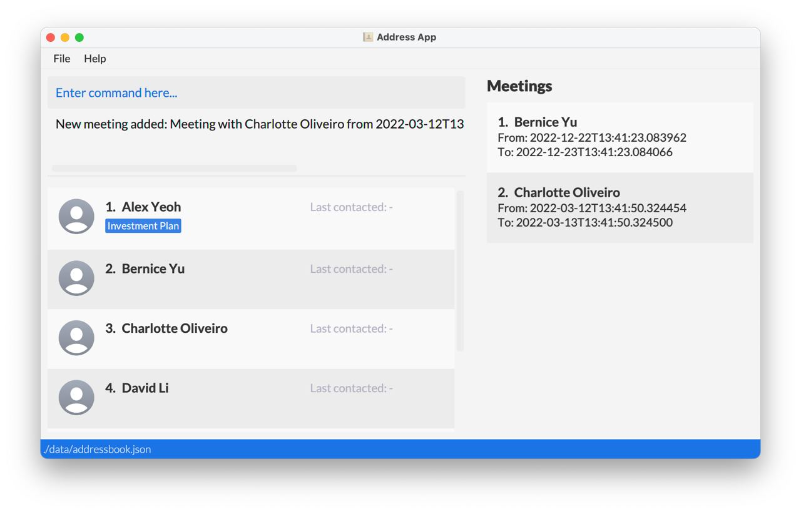
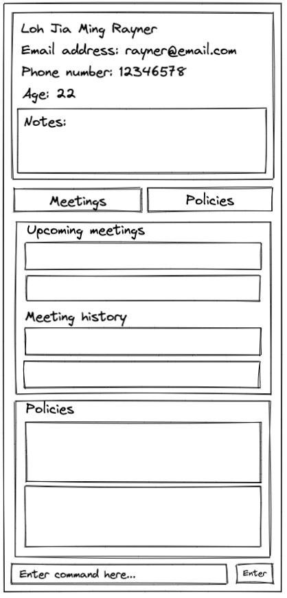

iss---
layout: page
title: User Guide
---

onlyFAs is for high achieving financial advisors looking to maintain and develop good relationships with current and potential clients. It allows users to maintain an all-encompassing client manager app that can easily arrange for meetups with clients. Currently, financial advisors might have to rely on apps like Google Calendar, and do not have a dedicated platform catered to helping them manage their clientele.

- [Quick start](#quick-start)
- [Features](#features)
    * [Viewing help : `help`](#viewing-help--help)
    * [Add client: `addClient`](#add-client-addclient)
    * [View client: `viewClient`](#view-client-viewclient)
    * [Update client: `updateClient`](#update-client-updateclient)
    * [Delete client: `deleteClient`](#delete-client-deleteclient)
    * [Add notes for client: `addNote`](#add-note-for-client-addnote)
    * [Add preferences to client: `addPref`](#add-preferences-to-client-addpref)
    * [Add policy: `addPolicy`](#add-policy-addpolicy)
    * [Edit policy: `editPolicy`](#edit-policy-editpolicy)
    * [Delete policy: `deletePolicy`](#delete-policy-deletepolicy)
    * [Add meeting: `addMeeting`](#add-meeting-addmeeting)
    * [View All Meetings: `meetings`](#view-all-meetings-meetings)
    * [Update Meeting Details: `updateMeeting`](#update-meeting-details-updatemeeting)
    * [Delete Meeting: `deleteMeeting`](#delete-meeting-deletemeeting)
    * [Clearing all entries : `clear`](#clearing-all-entries--clear)
    * [Exiting the program : `exit`](#exiting-the-program--exit)
    * [Saving the data](#saving-the-data)
    * [Editing the data file](#editing-the-data-file)
    * [Archiving data files `[coming in v2.0]`](#archiving-data-files-coming-in-v20)
- [FAQ](#faq)
- [Mockups](#mockups)
- [Command summary](#command-summary)

---

## Quick start

1. Ensure you have Java `11` or above installed in your Computer.

1. Download the latest `onlyfas.jar` **(Coming Soon!)**  <!--- from [here](https://github.com/se-edu/addressbook-level3/releases). -->

1. Copy the file to the folder you want to use as the **home folder** for _onlyFAs_.

1. Double-click the file to start the app. The GUI similar to the below should appear in a few seconds. Note how the app contains some sample data. 
   

1. Type the command in the command box and press Enter to execute it. e.g. typing **`help`** and pressing Enter will open the help window. 
   Some example commands you can try:

    - **`list`** : Lists all contacts.

    - **`addClient`**`n/John Doe p/98765432 e/johnd@example.com a/John street, block 123, #01-01` : Adds a client 
      named `John Doe` to your contact list.

    - **`delete`**`3` : Deletes the 3rd contact shown in the current list.

    - **`clear`** : Deletes all contacts.

    - **`exit`** : Exits the app.

1. Refer to the [Features](#features) below for details of each command.

---

## Features

**:information_source: Notes about the command format:** 

- Words in `UPPER_CASE` are the parameters to be supplied by the user. 
  e.g. in `add n/NAME`, `NAME` is a parameter which can be used as `add n/John Doe`.

- Items in square brackets are optional. 
  e.g `n/NAME [t/TAG]` can be used as `n/John Doe t/friend` or as `n/John Doe`.

- Items with `…`​ after them can be used multiple times including zero times. 
  e.g. `[t/TAG]…​` can be used as ` ` (i.e. 0 times), `t/friend`, `t/friend t/family` etc.

- Parameters can be in any order. 
  e.g. if the command specifies `n/NAME p/PHONE_NUMBER`, `p/PHONE_NUMBER n/NAME` is also acceptable.

- If a parameter is expected only once in the command but you specified it multiple times, only the last occurrence of the parameter will be taken. 
  e.g. if you specify `p/12341234 p/56785678`, only `p/56785678` will be taken.

- Extraneous parameters for commands that do not take in parameters (such as `help`, `list`, `exit` and `clear`) will be ignored. 
  e.g. if the command specifies `help 123`, it will be interpreted as `help`.

### Viewing help : `help`

Shows a message explaining how to access the help page.

Format: `help`

### Add client: `addClient`

Adds a client to the list of managed clients

Format: `addClient n/NAME p/PHONE_NUMBER [e/EMAIL a/ADDRESS]`

Examples:

- `addClient n/N Vijay Narayanan p/99134234 a/abc street`
- `addClient  n/Zechary Au Jun Wen p/92144213 e/zechary@yeemail.com`

### View client: `viewClient`

View a client in your address book.

Format: `viewClient INDEX`

Examples:

- `viewClient 1`

### Update client: `updateClient`

Update a client from in your address book.

Format: `updateClient INDEX [n/NEW_NAME p/NEW_PHONE_NUMBER e/NEW_EMAIL a/NEW_ADDRESS]`

Examples:

- `updateClient 1 e/new@email.com`

### Delete client: `deleteClient`

Delete a client from your address book.

Format: `deleteClient INDEX`

Examples:

- `deleteClient 1`

### Add note for client: `addNote`

Adds a plaintext note to a specific client

Format: `addNote INDEX nt/NOTE`

- `addNote 1 nt/Commando NSF with high risk of injury`
- `addNote 2 nt/Look up on policies for emergency care`

### Add preferences to client: `addPref`

Adds a preference to a specific client

Format: `addPref INDEX t/TAG d/DESCRIPTION`

Examples:

- `addPref 1 t/Drink d/Coke`
- `addPref 2 t/Cigarettes d/Malboro`

### Add policy: `addPolicy`

Adds an insurance policy to a specific client

Format: `addPolicy INDEX n/POLICY_NAME c/COMPANY pm/POLICY_MANAGER_NAME $/PREMIUM_AMOUNT`

Examples:

- `addPolicy 1 n/Medicare Plus c/Medicare pm/Zechary $/100`
- `addPolicy 2 n/Car Insurance c/Mercedes pm/Vijay $/250`

### Edit policy: `editPolicy`

Updates an insurance policy for a specific client

Format: `editPolicy INDEX pi/POLICY_INDEX [n/POLICY_NAME] [c/COMPANY] [pm/POLICY_MANAGER_NAME] 
[$/PREMIUM_AMOUNT]`

Examples:

- `editPolicy 1 ci/1 $/200`
- `editPolicy 1 ci/2 n/Car Insurance Plus c/Mercedes pm/Zechary $/350`

### Delete policy: `deletePolicy`

Deletes an insurance policy from a specific client

Format: `deletePolicy INDEX pi/POLICY_INDEX`

Examples:

- `deletePolicy 1 pi/1`

### Add meeting: `addMeeting`

Add a meeting to your schedule.

Format: `addMeeting INDEX ms/START_DATETIME me/END_DATETIME`

:bulb: **Tip:**
    DATETIME format is YYYY-MM-DD,HH:mm

Examples:

- `addMeeting 1 ms/2022-01-01,11:00 me/2022-01-01,12:00`
- `addMeeting 2 ms/2022-12-27,16:00 me/2022-12-27,17:00`

### View All Meetings: `meetings`

Shows all upcoming meetings.

Format: `meetings`

### Update Meeting Details: `updateMeeting`

Update details of a particular meeting.

Format: `updateMeeting INDEX [ms/NEW_START_DATETIME] [me/NEW_END_DATETIME]`

:bulb: **Tip:**
    DATETIME format is YYYY-MM-DD,HH:mm

Examples:

- `updateMeeting 1 ms/2022-01-01,08:00 me/2022-01-01,09:00`

### Delete meeting: `deleteMeeting`

Deletes a meeting

Format: `deleteMeeting INDEX`

Examples:

- `deleteMeeting 1`

###Save to hard drive

OnlyFAs’s data is saved in the hard drive automatically after any command that changes the data. There is no need to save manually.

### Clearing all entries : `clear`

Clear all entries in onlyFAs.

Format: `clear`

### Exiting the program : `exit`

Exit the program.

Format: `exit`

### Saving the data

onlyFAs' data is saved in the hard disk automatically after any command that changes the data. There is no need to save manually.

### Editing the data file

onlyFAs' data is saved in a JSON file `[JAR file location]/data/data.json`. Advanced users are welcome to update data directly by editing that data file.

:exclamation: **Caution:**
If your changes to the data file makes its format invalid, onlyFAs will discard all data and start with an empty data file at the next run.

### Archiving data files `[coming in v2.0]`

_Details coming soon ..._

---

## FAQ

**Q**: How do I transfer my data to another Computer? 
**A**: Install the app in the other computer and overwrite the empty data file it creates with the file that contains the data of your previous onlyFAs home folder.

---

## Mockups

---

## Command summary

| Action            | Format, Examples                                                                                                                                       |
|-------------------|--------------------------------------------------------------------------------------------------------------------------------------------------------|
| **addClient**     | `addClient n/NAME p/PHONE_NUMBER [e/EMAIL a/ADDRESS]`   e.g., `addClient n/N Vijay Narayanan p/99134234 a/abc street`                               |
| **viewClient**    | `viewClient INDEX`  e.g., `viewClient 1`                                                                                                            |
| **updateClient**  | `updateClient INDEX [n/NEW_NAME p/NEW_PHONE_NUMBER e/NEW_EMAIL a/NEW_ADDRESS]`  e.g.,`updateClient 1 e/new@email.com`                               |
| **deleteClient**  | `deleteClient INDEX`   e.g., `deleteClient 1`                                                                                                       |
| **addNote**       | `addNote INDEX nt/NOTE`   e.g., `addNote 1 nt/Commando NSF with high risk of injury`                                                                |
| **addPref**       | `addPref INDEX t/TAG d/DESCRIPTION`   e.g., `addPref 1 t/Drink d/Coke`                                                                              |
| **addPolicy**     | `addPolicy INDEX n/POLICY_NAME c/COMPANY pm/POLICY_MANAGER_NAME $/PREMIUM_AMOUNT`   e.g., `addPolicy 1 n/Medicare Plus c/Medicare pm/Zechary $/100` |
| **editPolicy**    | `editPolicy INDEX pi/POLICY_INDEX [n/POLICY_NAME] [c/COMPANY] [pm/POLICY_MANAGER_NAME] [$/PREMIUM_AMOUNT]`   e.g., `editPolicy 1 pi/1 $/200`        |
| **deletePolicy**  | `deletePolicy INDEX pi/POLICY_INDEX`   e.g., `deletePolicy 1 pi/1`                                                                                  |
| **addMeeting**    | `addMeeting INDEX ms/START_DATETIME me/END_DATETIME`   e.g., `addMeeting 2 ms/2022-12-27,16:00 me/2022-12-27,17:00`                                 |
| **meetings**      | `meetings`                                                                                                                                             |
| **updateMeeting** | `updateMeeting INDEX [ms/NEW_START_DATETIME me/NEW_END_DATETIME]`   e.g., `updateMeeting 1 ms/2022-01-01,08:00 me/2022-01-01,09:00`                 |
| **help**          | `help`                                                                                                                                                 |
